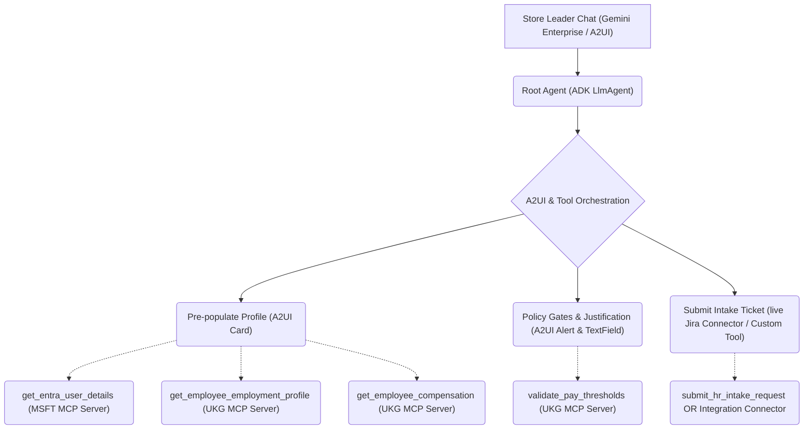

# Gemini Enterprise & MCP Customer Proof of Concepts (PoCs)

Welcome to the **`ge-customer-pocs`** reference repository! This repository contains complete, production-ready Proof of Concepts (PoCs) and reference implementations demonstrating how to build highly advanced, interactive, and secured AI agents for **Gemini Enterprise (Vertex AI Agent Builder)** using the **Model Context Protocol (MCP)**, **Agent-to-UI (A2UI)**, and **Agent-to-Agent (A2A)** protocols.

These assets demonstrate how to connect retail store networks and corporate HR systems to LLM reasoning engines, perform real-time policy auditing, stream rich widgets, and file structured review tickets.

---

## 📂 Table of Contents & Sub-Projects

| Sub-Project Link | Technologies Used | Description |
| :--- | :--- | :--- |
| 🇬🇧 [**`ukg-mock-api-mcp/`**](file:///usr/local/google/home/ravindranv/Code/Repos/ge-customer-pocs/ukg-mock-api-mcp/README.md) | FastMCP, FastAPI, BigQuery, Cloud Run | A complete MCP server integration backed by a mock BigQuery dataset, exposing secure employee payroll profiles, compensation metrics, and pay grade auditing thresholds. |
| 🏢 [**`msft-mock-api-mcp/`**](file:///usr/local/google/home/ravindranv/Code/Repos/ge-customer-pocs/msft-mock-api-mcp/README.md) | FastMCP, FastAPI, BigQuery, Cloud Run | A complete MCP server exposing Microsoft Entra ID (formerly Active Directory) directory details via standard Graph API user properties. |
| 🤖 [**`sample-hr-change-intake-agent/hr-intake/`**](file:///usr/local/google/home/ravindranv/Code/Repos/ge-customer-pocs/sample-hr-change-intake-agent/hr-intake/README.md) | ADK Python, A2UI, A2A, Dotenv, Stdio MCP | A premium, ReAct-based HR Personnel Change Intake Agent that guides Store Leaders through promotions, transfers, and terminations. Integrates both MCP servers concurrently, audits policy triggers, and streams rich forms via A2UI. |

---

## 📐 System Architecture Overview

The following architecture diagram visualizes how the **HR Change Intake Agent** orchestrates directory and compensation actions concurrently across both the **UKG Pro** and **Microsoft Entra ID** mock MCP microservices deployed on Cloud Run:

---

## 🔑 General Setup & Deployment Workflow

For detailed instructions on configuring, validating, and deploying each sub-project, navigate directly to their respective directories and review their dedicated guides:

1.  **Configure the Mock Databases & APIs:**
    *   Follow the BigQuery seeding guides inside [`ukg-mock-api-mcp/README.md`](file:///usr/local/google/home/ravindranv/Code/Repos/ge-customer-pocs/ukg-mock-api-mcp/README.md) and [`msft-mock-api-mcp/README.md`](file:///usr/local/google/home/ravindranv/Code/Repos/ge-customer-pocs/msft-mock-api-mcp/README.md) to configure tables and deploy mock APIs/MCPs to Cloud Run.
2.  **Set Up Google Cloud OAuth 2.0:**
    *   Configure your APIs & Services credentials, add the callback redirect URIs, and obtain client credentials to securely register the custom MCP servers in your Gemini Enterprise workspace.
3.  **Bootstrap the Intake Agent:**
    *   Navigate to [`sample-hr-change-intake-agent/hr-intake/README.md`](file:///usr/local/google/home/ravindranv/Code/Repos/ge-customer-pocs/sample-hr-change-intake-agent/hr-intake/README.md), copy `.env.example` to `.env` (managing paths and region variables dynamically), start the services, and run verification checks or cloud deployments.

---

## 📢 Access Notice
Access to this repository is temporary (30 days). Ensure you have cloned the content before **2026-06-19**.
