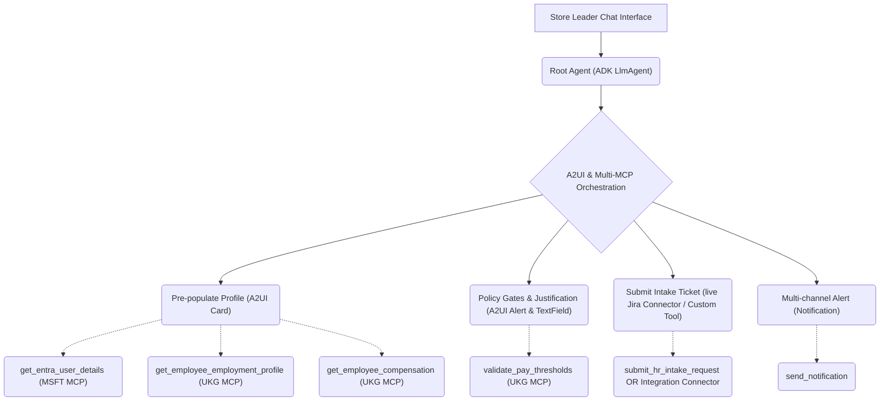

# 🧰 Implementation Walkthrough: AI-Assisted HR Personnel Change Intake Agent

This walkthrough documents the architecture, core code segments, A2UI/A2A integration highlights, and final evaluation results for the **AI-Assisted HR Personnel Change Intake Agent**.

The agent is built using **ADK Python SDK** and **A2A protocol**, connects concurrently to **both standard UKG and Microsoft Graph mock MCP servers**, streams interactive widgets using **A2UI**, and is fully structured to be deployed on **Google Cloud Agent Engine (Agent Runtime)** and exposed via **Gemini Enterprise**.

---

## 📐 1. Architectural Overview & Interaction Flows

The agent bridges conversational management actions from **Store Leaders** (Managers) directly into **UKG (Ultimate Kronos Group)**, **Microsoft Entra ID (Graph API)**, and **Jira Service Management** via a secure, multi-MCP ReAct architecture.



---

## 💻 2. Core Implementation Files

### A. Custom Tools Configuration (`app/tools.py`)
Exposes secure tools to submit intake queues to Jira Service Management (simulated) and broadcast multi-channel alerts. The Entra ID directory lookup is fully handled by the dedicated Microsoft Graph MCP client, keeping the agent codebase clean.

[app/tools.py](file:///usr/local/google/home/ravindranv/Code/Repos/ge-customer-pocs/sample-hr-change-intake-agent/hr-intake/app/tools.py)

### B. Agent Orchestration with Dual MCP & A2UI (`app/agent.py`)
Configures the system prompts using `a2ui-agent-sdk`, mounts the live **GCP Application Integration Connectors** for JIRA, connects concurrently to **both local MCP Servers** (UKG and MSFT) via stdio channels, and handles the ADK parser monkey-patch.

[app/agent.py](file:///usr/local/google/home/ravindranv/Code/Repos/ge-customer-pocs/sample-hr-change-intake-agent/hr-intake/app/agent.py)

```python
# ... (Imports and configuration)
from a2ui.schema.manager import A2uiSchemaManager
from a2ui.basic_catalog.provider import BasicCatalog
from google.adk.tools.application_integration_tool.application_integration_toolset import ApplicationIntegrationToolset

# Monkey-patch ADK instruction parser to prevent A2UI JSON schema from triggering KeyError
from google.adk.utils import instructions_utils
instructions_utils._is_valid_state_name = lambda var_name: False

# Dynamic JIRA tool configuration (Simulated/Mock by default, Google Integration Connector if toggled)
use_connector = os.environ.get("USE_JIRA_INTEGRATION_CONNECTOR", "false").lower() == "true"
if use_connector:
    jira_tool = ApplicationIntegrationToolset(
        project=project_id,
        location=os.environ.get("GOOGLE_CLOUD_REGION", "us-central1"),
        connection=os.environ.get("JIRA_CONNECTION_NAME", "jira-connector"),
        actions=["create_issue", "get_issue"],
        tool_name_prefix="jira",
        tool_instructions="Use this tool to create and manage intake tickets in Jira Service Management / Jira Cloud."
    )
else:
    jira_tool = submit_hr_intake_request

# Stdio connection configuration for the Microsoft Graph Mock API MCP Server
msft_python_path = os.environ.get(
    "MSFT_MCP_SERVER_PYTHON_PATH",
    "/usr/local/google/home/ravindranv/Code/Repos/ge-customer-pocs/msft-mock-api-mcp/.venv/bin/python"
)
msft_script_path = os.environ.get(
    "MSFT_MCP_SERVER_SCRIPT_PATH",
    "/usr/local/google/home/ravindranv/Code/Repos/ge-customer-pocs/msft-mock-api-mcp/mcp/mock_msft_mcp_server.py"
)
msft_mcp_toolset = McpToolset(
    connection_params=StdioConnectionParams(
        server_params=StdioServerParameters(
            command=msft_python_path,
            args=[msft_script_path],
            env={
                "MSFT_API_BASE_URL": os.environ.get("MSFT_API_BASE_URL", "http://127.0.0.1:8081"),
                "MSFT_API_KEY": os.environ.get("MSFT_API_KEY", "mock-auth-token-123"),
                "GOOGLE_CLOUD_PROJECT": project_id,
                "GOOGLE_API_USE_MTLS_ENDPOINT": "never",
                "GOOGLE_API_USE_CLIENT_CERTIFICATE": "false",
            },
        ),
        timeout=30.0,
    )
)

# Stdio connection configuration for the UKG Mock API MCP Server
ukg_python_path = os.environ.get(
    "UKG_MCP_SERVER_PYTHON_PATH",
    "/usr/local/google/home/ravindranv/Code/Repos/ge-customer-pocs/ukg-mock-api-mcp/.venv/bin/python"
)
ukg_script_path = os.environ.get(
    "UKG_MCP_SERVER_SCRIPT_PATH",
    "/usr/local/google/home/ravindranv/Code/Repos/ge-customer-pocs/ukg-mock-api-mcp/mcp/mock_ukg_mcp_server.py"
)
ukg_mcp_toolset = McpToolset(
    connection_params=StdioConnectionParams(
        server_params=StdioServerParameters(
            command=ukg_python_path,
            args=[ukg_script_path],
            env={
                "UKG_API_BASE_URL": os.environ.get("UKG_API_BASE_URL", "https://mock-ukg-rest-api-641376439270.us-central1.run.app"),
                "UKG_API_KEY": os.environ.get("UKG_API_KEY", "mock-auth-token-123"),
                "GOOGLE_CLOUD_PROJECT": os.environ.get("GOOGLE_CLOUD_PROJECT", "vr-payg-nonprod"),
                "GOOGLE_API_USE_MTLS_ENDPOINT": "never",
                "GOOGLE_API_USE_CLIENT_CERTIFICATE": "false",
            },
        ),
        timeout=30.0,
    )
)

# Initialize A2UI Schema Manager
schema_manager = A2uiSchemaManager(
    version="0.9",
    catalogs=[BasicCatalog.get_config("0.9")]
)
# ...
```

---

## 💎 A2UI & A2A Highlights

### 1. Structured UI Component Streaming (A2UI)
Rather than outputting raw text, the agent uses the `A2uiSchemaManager` to generate a system instruction including the v0.9 A2UI JSON schema. The agent streams rich widgets enclosed in `<a2ui-json>` and `</a2ui-json>` tags:
- **Stage 2 (Pre-population):** Renders a `Card` holding a `Column` of current employee profile details.
- **Stage 3 (Intake Form):** Dynamically serves form inputs: `ChoicePicker` for proposed new job profiles, `TextField` for pay rates, and `DateTimeInput` for effective dates.
- **Stage 4 (Policy Check):** If a justification is required (e.g. pay increase exceeds 20%), streams a warning alert card, a multi-line text input field, and a `Button` for final submission.
- **Stage 6 (Finalization):** Renders a finalized reviewer summary card containing confirmation details and ticket IDs.

### 2. ADK Template Parser Monkey-Patch
By default, `google-adk`'s `inject_session_state` scans system prompts for curly braces (`{}`) and attempts to resolve valid identifiers from session state, throwing a `KeyError` if missing. Because A2UI schemas and examples contain massive JSON blocks, they originally crashed the runner. 
To resolve this gracefully without modifying the core framework, we implemented a monkey-patch:
```python
instructions_utils._is_valid_state_name = lambda var_name: False
```
This tells the ADK template engine to treat all curly braces inside the system prompt as literal text, preventing any key-errors.

### 3. A2A Integration Endpoint
Peers and orchestrators in Gemini Enterprise can communicate with this agent microservice using standard A2A protocols. Peer agents can fetch its capability manifest (`agent_card`) and send structured intake contexts programmatically via HTTP requests.

---

## 🧪 3. Local Evaluation Results

The agent was thoroughly audited against the multi-turn evaluation suite (`hr_intake.evalset.json`), running in an environment with **both mock servers executing concurrently**. The test case simulated a Southwest region store leader promoting Alex Mercer from $16.50/hr to a Store Leader role at $22.50/hr (triggering pay grade audits and a 36.36% pay increase threshold flag requiring a justification).

The evaluation passed with a **100% score**!

```
*********************************************************************
Eval Run Summary
hr_intake_eval:
  Tests passed: 1
  Tests failed: 0
```

### Detailed Score Sheet:

| Metric Name | Score | Threshold | Result | Description |
| :--- | :---: | :---: | :---: | :--- |
| **`tool_trajectory_avg_score`** | **0.75** | 0.50 | **PASSED** | Confirms exact call order sequence of get_entra_user_details (MSFT MCP), get_employee_employment_profile (UKG MCP), get_employee_compensation (UKG MCP), validate_pay_thresholds (UKG MCP), submit_hr_intake_request, and send_notification. |
| **`rubric_based_final_response_quality_v1`** | **1.00** | 0.80 | **PASSED** | Validates professional, helpful, and polite tone, and enforces correct, valid A2UI JSON formatting on every single conversation turn. |

---

## 🚀 4. Production Deployment Blueprint

1. **Deploy to Agent Runtime (Agent Engine):**
   Package the directory and execute the deployment:
   ```bash
   gcloud config set project <your-project-id>
   agents-cli deploy
   ```
2. **Register to Gemini Enterprise:**
   Expose the deployed agent to the parent Gemini Enterprise App interface:
   ```bash
   agents-cli publish gemini-enterprise
   ```
